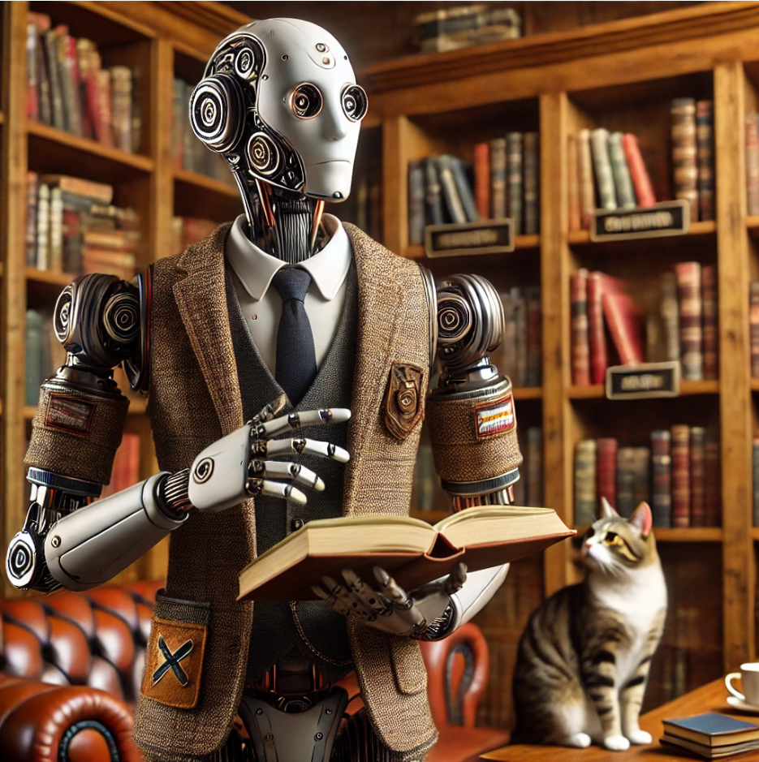

## Digital Humanities in the Age of AI

### The Tools

- [Text](https://chatgpt.com/)
- [Image](https://www.adobe.com/products/firefly.html)
- [Video](https://runwayml.com/)
- [Audio](https://labs.google/fx/tools/music-fx)

### Distant Reading

- [Demo: Distant Read with ChatGPT](https://anastasiasalter.net/Creative-Coding/distant_read.html)
- [Source Files: Project Gutenberg](https://www.gutenberg.org/)

### Generating Code

- [Example: AI AdminLife](https://anastasiasalter.net/AIAdmin/)
- [Demo: Generating P5.js](https://openprocessing.org/)